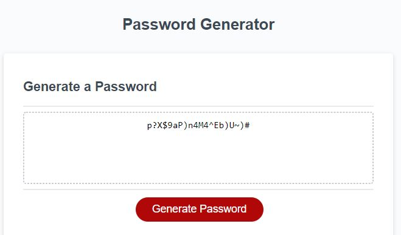

# 3-password-gen-js

Password Generator JS

https://adgrossm.github.io/3-password-gen-js/

This project is our 3rd homework assignment of the Full Stack Developer Bootcamp. We have been provided a basic framework for the html and CSS files. The main objective is to write the code for the JavaScript to run a password generator on a website. Our goal is to create an application that generates a random password based on user-selected criteria. This app will run in the browser and feature dynamically updated HTML and CSS powered by your JavaScript code. It will also feature a clean and polished user interface and be responsive, ensuring that it adapts to multiple screen sizes.

